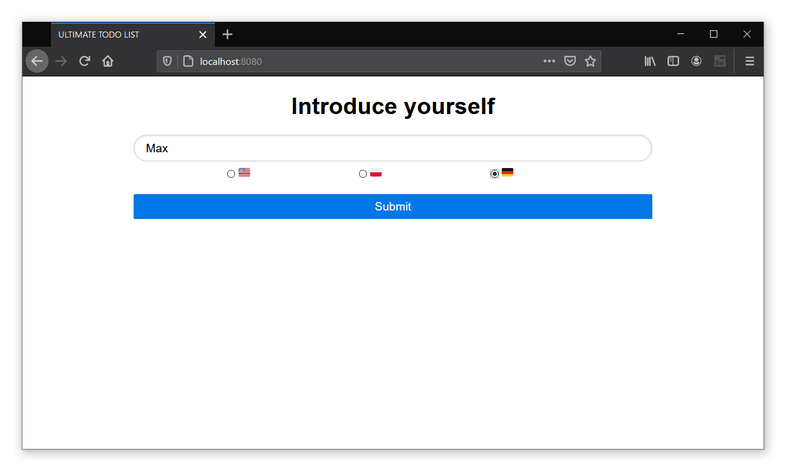
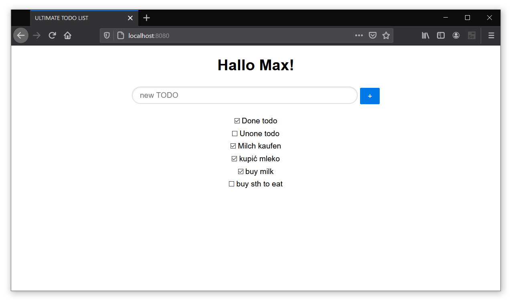

# Simple web app - ***Spring Boot***
## I used
* SQL - H2 database
* Hibernate
* Flywaydb
* Java + Maven

----
* Pure.css
* HTML + CSS + JavaScript

# How it works
### Start page

  

### Task management

  

